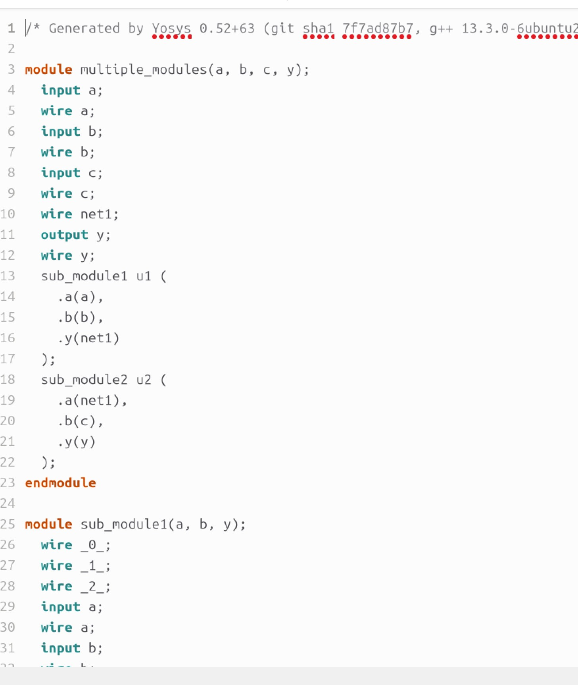
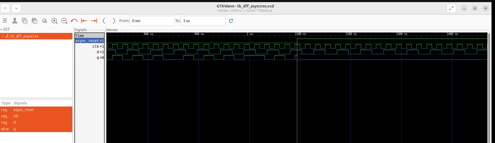
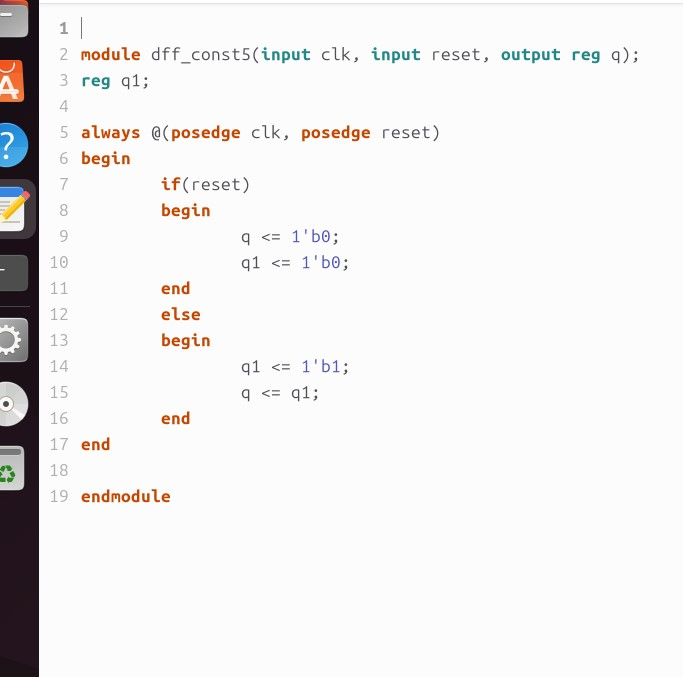
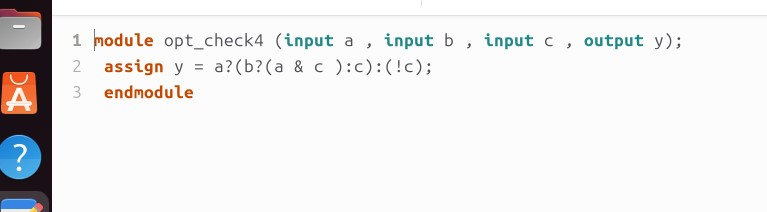
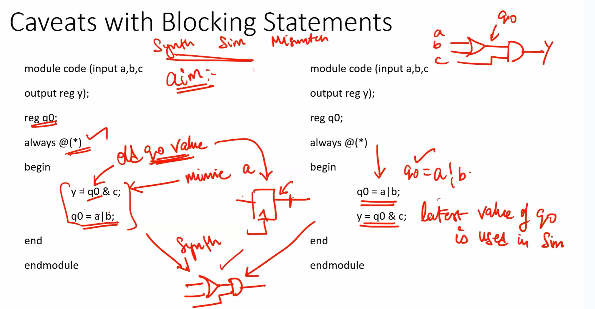
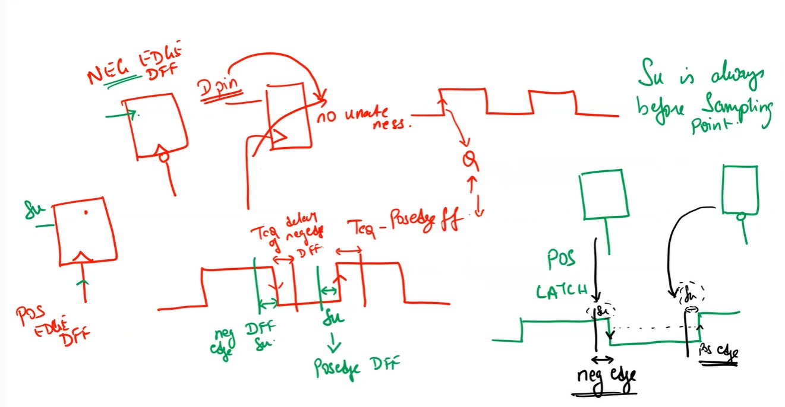

  
 SFAL_VSD SOC

  This project is to create an SOC from specifications to netlist.

  
 Week 0 - Day 0 - Tools Installation

  All the instructions for installation of required tools can be found here:
  - **SYSTEM CHECK**
    - 6GB RAM, 50 GB HDD
    - Ubuntu 20.04+
    - 4vCPU
    
  - **TOOL CHECK**
    - **Yosys**
      - $ sudo apt-get update
      - $ git clone https://github.com/YosysHQ/yosys.git
      - $ cd yosys
      - $ sudo apt install make (If make is not installed please install it) 
      - $ sudo apt-get install build-essential clang bison flex \
            libreadline-dev gawk tcl-dev libffi-dev git \
            graphviz xdot pkg-config python3 libboost-system-dev \
            libboost-python-dev libboost-filesystem-dev zlib1g-dev
      - $ make config-gcc
      - $ make 
      - $ sudo make install
      -  
    - **Iverilog** - Steps to install iverilog
      - sudo apt-get update
      - sudo apt-get install iverilog
      - 
    - **GTKWAVE** - Steps to install gtkwave
      - sudo apt-get update
      - sudo apt install gtkwave
      - 

    - **ngspice** - After downloading the tarball from https://sourceforge.net/projects/ngspice/files/ to a local directory, unpack it using:
      - $ tar -zxvf ngspice-37.tar.gz
      - $ cd ngspice-37
      - $ mkdir release
      - $ cd release
      - $ ../configure  --with-x --with-readline=yes --disable-debug
      - $ make
      - $ sudo make install
    - **magic**
      - $ sudo apt-get install m4
      - $ sudo apt-get install tcsh
      - $ sudo apt-get install csh
      - $ sudo apt-get install libx11-dev
      - $ sudo apt-get install tcl-dev tk-dev
      - $ sudo apt-get install libcairo2-dev
      - $ sudo apt-get install mesa-common-dev libglu1-mesa-dev
      - $ sudo apt-get install libncurses-dev
      - git clone https://github.com/RTimothyEdwards/magic
      - cd magic
      - ./configure
      - make
      - make install

  
 Week 1 - Day 1 - Introduction to Verilog RTL Design and Synthesis

  
  - **Introduction to iverilog testbench**
    - RTL Design adherence to the initial architecture specifications is checked by simulation of the design using a simulator tool. That simulator tool we are using here is iverilog.
    - Design is actual verilog/system verilog code with intended functionality. Has primary inputs and outputs in form of wires or logic/registers/memory elements.
    - Testbench is a set of stimulus applied with delays and initialisation to ensure that design meets functionality. Does not have any primary inputs or outputs.
    - Simulator looks for changes in the input signals, based on this, checks its influence on output signals.

  - **Labs using iverilog and gtkwave**
    - used iverilog to simulate design and testbench of good mux
    - used gtkwave to view the dumped "value change dump" or vcd file
    - learnt to use iverilog and gtkwave commands
    - saw the design and tb files
   
  - **Introduction to Yosys and Logic Synthesis**
    - used Yosys as the synthesizer tool, learnt what synthesis meant
    - learnt about yosys setup and verification flow, tb for netlist is same as that of rtl design
    - Learnt about rtl design, synthesis and its illustration, library cells, flavours of library cells
    - Also learnt about usage of faster versus slower cells, need wider transistors and why we need them

  - **Labs using Yosys and Sky103PDKs**
    - Synthesised good mux using yosys
    - OBSERVATION made: I saw only one type of library cell (constrasting to the video) and therefore my good mux design was synthesised using only that library cell
    - the library cell was sky130_fd_sc_hd__tt_025C_1v80.lib
    - good mux finally synthesised and the cells it inferred was just 1 2_1 mux cell since only one lib file was there.
    - **Commands used:**
      - read_liberty -lib lib/sky130_fd_sc_hd__tt_025C_1v80.lib
      - read_verilog verilog_files/good_mux.v
      - hierarchy -top good_mux
      - synth -top good_mux
      - abc -liberty lib/sky130_fd_sc_hd__tt_025C_1v80.lib
      - show
      - write_verilog -noattr synth_out.v
    - **Images for this lab**
      - 
      - 
      - 
      - 
      - 
      - 
      - 
      - 
      - 
      - 
      - 
      - 
      - 
      - 
      - 
      - 
      - 
      - 
      - 
      - 
      - 
      - 
      - 
      - 
      - 

  
 Week 1 - Day 2 - Timing Libs, Hierarchical versus flat synthesis, and efficient flop coding styles

  - **Introduction to Timing Libs**
  - **Hierarchical Versus Flat Synthesis**
  - **Various Flop Coding Styles and Optimisations**
  - **Images for this lab**
    - 
    - 
    - 
    - 
    - 
    - 
    - 
    - 
    - 
    - 
    - 
    - 
    - 
    - 
    - 
    - 
    - 
    - 
    - 
    - 
    - 
    - 
    - 
    - 
    - 
    - 
    - 
    - 
    - 
    - 
    - 
    - 
    - 
    - 
    - 
    - 
    - 
    -  
    

  

  
 Week 1 - Day 3 - Combinational and Sequential Optimisations

  - **Introduction to Optimisations**
  - **Combinational Logic Optimisations**
  - **Sequential Logic Optimisations**
  - **Sequential Logic Optimisations for unused outputs**
  - **Images for this lab**
    - 
    - 
    - 
    - 
    - 
    - 
    - 
    - 
    - 
    - 
    - 
    - 
    - 
    - 
    - 
    - 
    - 
    - 
    - 
    - 
    - 
    - 
    - 
    - 
    - 
    - 
    - 
    - 
    - 

 

  
 Week 1 - Day 4 - GLS, Blocking vs Non-Blocking, simulation-synthesis mismatch

  - **GLS, Synthesis-Simulation Mismatch, and Blocking vs Non-Blocking Statements**
    - Missing Sensitivity List
      - GLS introduction and flow with iverilog
      - 
      - 
      - Simulator works mainly on activity - changes in signal values whereas synthesiser only sees functionality
      - therefore having a correct and complete sensitivity list for always blocks is necessary to avoid synthesis simulation mismatch
      - Eg of a mux, difference between always@(sel) and always@(*) is highlighted
      - 
    - Blocking and Non-Blocking statements
      - Caveat with blocking nonblocking statements are discussed
      - Example of aiming for a shift register is used
      - if blocking assignment is used it is seen as a single flop instead of two flops, this is wrong, as all statements are evaluated in order and assignment of rhs to lhs happens before moving on to next statement, giving wrong behaviour
      - 
      - 
      - So always use non blocking statement for sequential logic generation, as in non-blocking order of statements do not matter and all rhs is evaluated before all lhs.
      - 
  - **Labs on GLS and Synthesis-Simulation Mismatch**
    - Example of ternary operator based mux used
    - simulated, synthesised and got netlist, these are the results I got
    - 
    - 
    - but this was the expected netlist output
    - 
    - Ran to get GLS netlist next to get smae simulation result
    - 
    - Second example showed synthesis and simulation mismatch for bad mux
    - 
    - **Commands used to get GLS**
      - iverilog my_lib/verilog_model/primitives.v my_lib/verilog_model/sky130_fd_sc_hd.v ternary_operator_netlist.v verilog_files/tb_ternary_operator_mux.v
      - ./a.out
      - gtkwave tb_ternary_operator_mux.vcd

  - **Labs on Synthesis-Simulation Mismatch for Blocking Statements**
    - exmaples of synthesis simulation mismatch for blocking statements here
    - 
    - 

 

  
 Week 2 - Advanced Synthesis and STA with Design Compiler - Introduction to Logic Synthesis 

  - **Day1 - Lecture 1 - Introduction to the course**
    - **Common terminology used are**
    - Synopsys Design Constraints or SDC is commonly used in industry. It is based on tool command language or tcl.
    - We do a lab of using an imaginary library to invoke DC and see what happens - it is not able to read the yourlibrary.lib file.
    - So, we see that if we write the netlist, it is written in the form of gtech cells. Gtech in DC is the virtual library in DC's memory to understand the design.
    - Even after giving the sky130 library file, it gives same wrong output
    - So, what is missing is the two environment variables to be set to the target sky130 library ie the link_library and the target_library.
    - After that we need to set link library, here * represents all libraries loaded previously in DC's memory.
    - This, inclusing * is so that we don't override the existing loaded libraries in DC's memory, just append my new library to be considered into the DC's memory.
    - Now, it clearly shows linking and loading the design into DC's memory.
  - **Lecture 2 - Introduction to DC and tool**
    - **Lab 1 - Invoking DC Basic Setup**
      - DC tool basic setup was dicussed how to setup link library, target library, how the library file highlights different characteristics of the standard cell and technology.
    - **Lab 2 - Introduction to DDC GUI with Design Vision**
    - **Lab3 - DC Synopsys DC Setup**
  - **Lecture 3- TCL Quick Refresher**
    - Basic concepts of tcl, code basics etc were discussed.
    - **Lab4 - TCL Commands**
  - **Images for the above labs**
    - 
    - 
    - 
    - 
    - 
    - 
    - 
    - 
    - 
    - 
    - 
    - 
    - 
    - 
    - 
    - 
    - 
    - 
    - 
    - 
    - 
    - 
    - 
    - 
    - 

  - **Day 2 - Basics of STA**
    - **Lecture 4 - Intro to STA**
      - Basics of STA concepts were described and learnt in great detail, with examples and diagrams
    - **Lecture 5 - What are Constraints**
      - Constraints are dicussed and transition time and output loads dicussed. Their impact on STA discussed.
    - **Lecture 6 - Input Trans and Output Load**
      - Basics were discussed how this affects setup and hold, operating frequency etc.
    - **Lab 5 - Timing dot libs**
      - Library files discussed
    - **Lab 6 - Exploring dotlib P1**
      - dot lib P1
    - **Lab 7 - Exploring dotlib P2**
      - dot lib P2
    - **Images for the Labs**
      - 
      - 
      - 
      - 
      - 
      - 
      - 
      - 
      - 
      - 
      - 
      - 
      - 
      - 
      - 
      - 
      - 
      - 
      - 
      - 
      - 
      - 
      - 
      - 
      - 
      - 
      - 
      - 
      - 
      - 
      - 
      - 

  - **Day 3 - Advanced STA**
    - **Lecture 7 - SDC P1 Clock and Clock Tree Modelling - Uncertainity**
      - Basics of clock uncertainity like jitter and skew, and how it impacts clock integrity and timing closure.
      - 
    - **Lecture 8 - SDC P2 IO Delays**
      - Discussion of input and output delay constraints
      - 
    - **Lab 8 -**
    - **Lab 9 -**
    - **Lab 10 -**
    - **Lab 11 -**
    - **Lab 12 -**
    - 

