Week 2 - Advanced Synthesis and STA with Design Compiler - Introduction to Logic Synthesis

This document talks about optimizations in synthesis and using advanced STA to do it.  

  
Day4 - Optimizations

  
  - **Lec11 - Combinational Optimizations**
      - optimizations like constant
      - 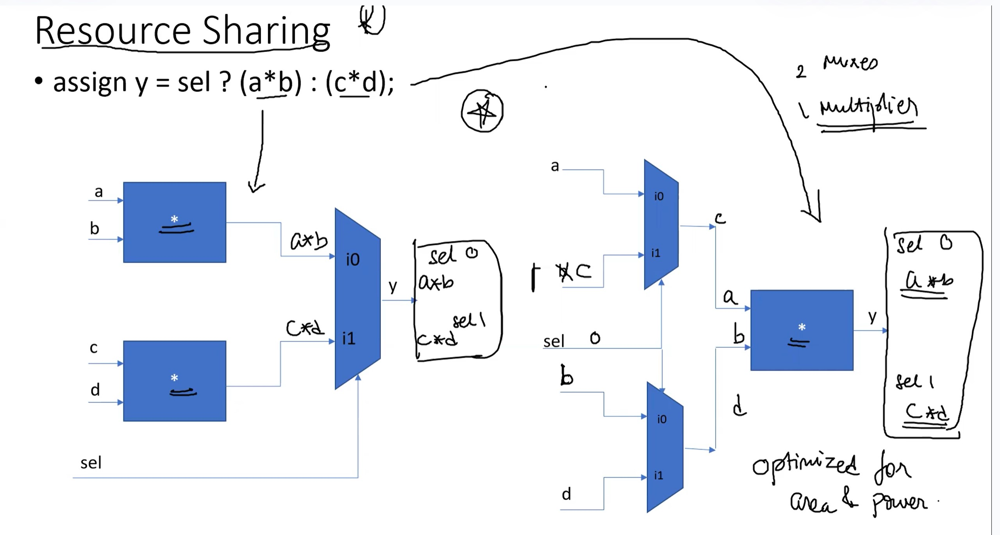
      - 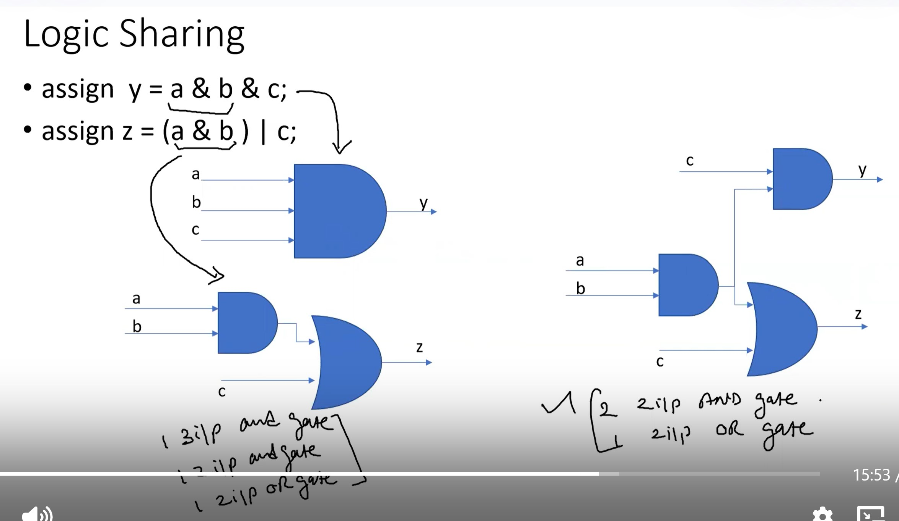
    - **Lec12 - Sequential Optimizations**
      - optimizations involing sequential elements
    - **Lab16 - Combinational Optimizations Part 1**
      - 
      - 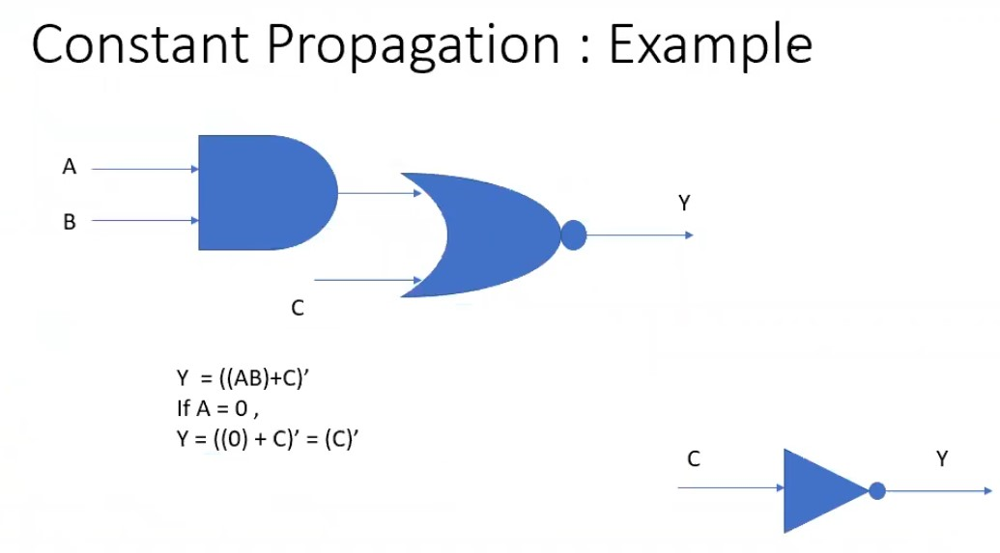
      - 
      - 
    - **Lab16 - Resource Sharing Optimizations Part2**
      - 
      - 
      - 
      - 
      - 
      - 
      - 
    - **Lab17 - Sequential Optimizations**
      - 
      - 
      - 
      - 
      - 
      - 
      - 
    - **Lec13 - Special optimizations**
      - 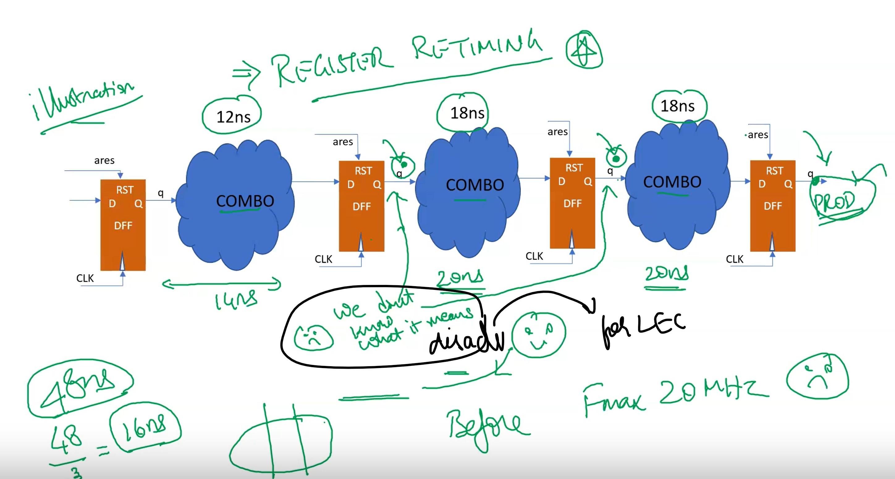
      - 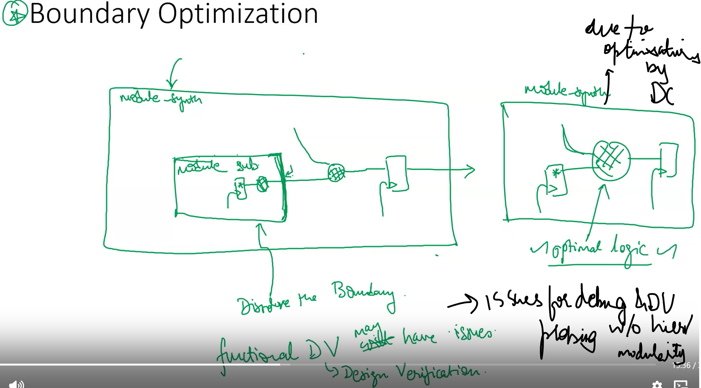
      - 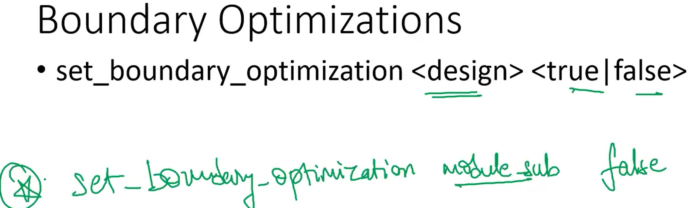
      - 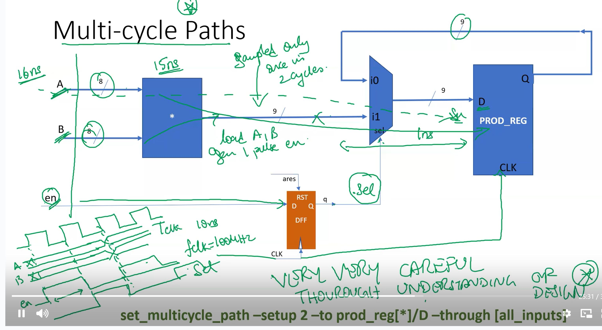
      - 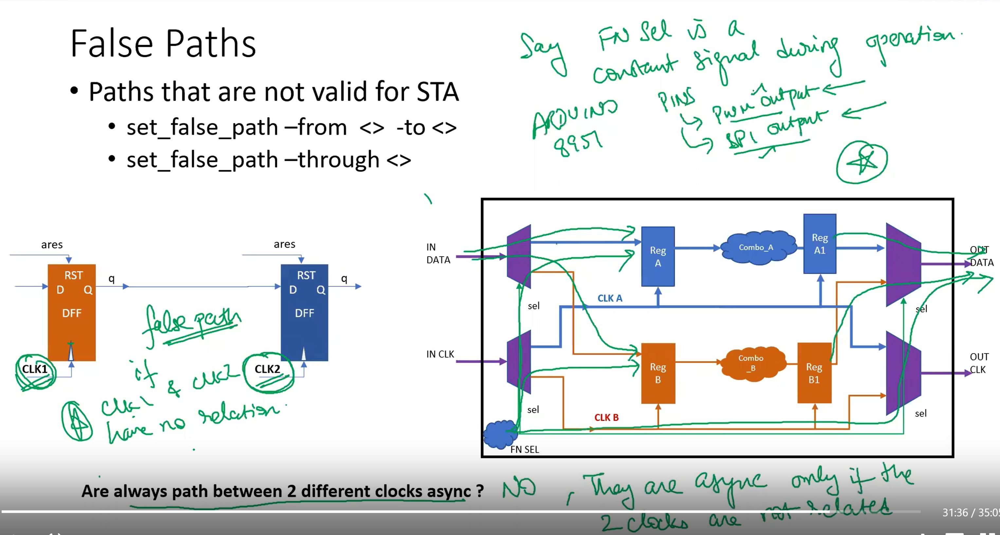
      - 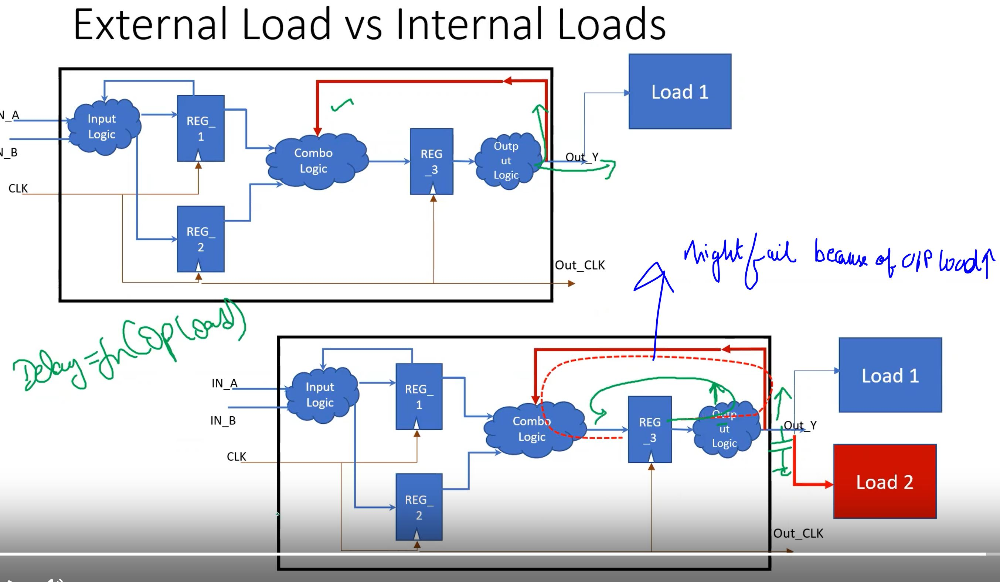
      - 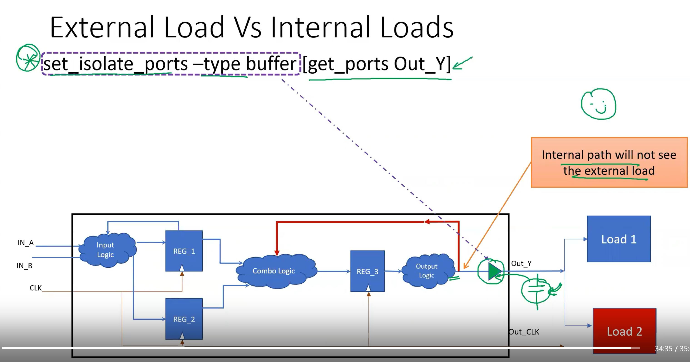
    - **Lec14 - How Paths are timed MCP**
      - 
      - 
      - 
      - 
      - 
      - 
    - **Lab18 - Boundary Optimmizations**
      - 
      - 
      - 
      - 
      - 
      - 
      - 
    - **Lab19 - Register Retiming**
      - 
      - 
      - 
      - 
    - **Lab20 - Isolating Output Ports**
      - 
      - 
      - 
      - 
      - 
      - 
    - **Lab21 - Multicycle Path**
      - 
      - 
      - 
      - 
      - 
      - 
      - 
      - 
      - 
      - 
      - 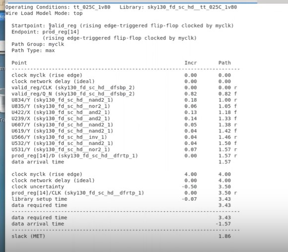
      - 
      - 

