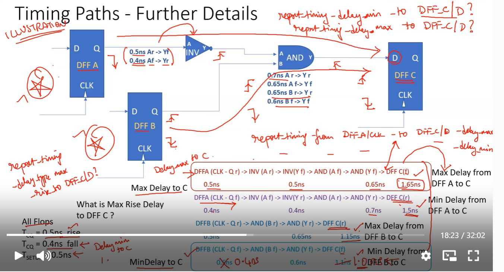

Week 2 - Advanced Synthesis and STA with Design Compiler - Introduction to Logic Synthesis

This document talks about quality checks, timing reports in DC.

  
Day5 - Quality Checks

  
  - **Lecture Report Timing**
    - Learnt about report_timing commands and -max_paths2 and nworst
    - difference between them
    -  
    - 
  - **Lab - Report Timing**
    - 
    - 
    - 
    - 
    - 
    - 
    - 
    - 
    - 
    - 
    - 
  - **Lab - Check Timing, check design and max_capacitance**
    - 
    - 
    - 
    - 
    - 
    - 
    - 
    - 
    - 
    - 
    - 
    - 
    - 
    - 
    - 
    - 
    - 
    - 
    - 
    - 
    - 
    - 
    - 
    - 
    - 

