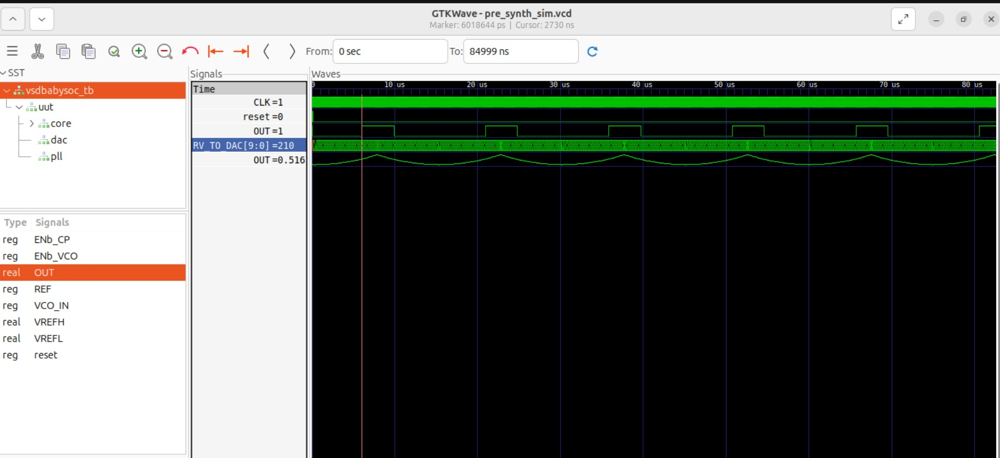

Week4 - BabySOC Modelling

This week we are learning about modelling and simulating VSD's BabySOC, with the RVMYTH processor, PLL and DAC components. Modelling will help us learn, understand and simulate the microarchitecture of the SOC, and observe the simulated GTKWave.

<details>
  <Summary> Introduction to BabySOC Modelling</Summary>
  
  - Model and simulate the VSDBabySoC using iverilog, then we will show the results using gtkwave tool. 
  - VSDBabysoc module is initialised with values, resulting in PLL's clock generation, CLK for the circuit. 
  - The CLK signal instruction memory instructions of RVMYTH processor to be executed. 
  - Register r17 will be filled values per cycle. 
  - DAC core uses the values from register r17 to give an output called OUT signal.

  - **Modelling of RVMYTH**
    - The RVMYTH processor written in TL-Verilog, must be written in Verilog.
    - Therefore, it is translated to verilog using Sandpiper saas [Here](https://github.com/shivanishah269/risc-v-core)
  - **Modelling of PLL and DAC**
    - These two analog components cannot be synthesised, hence their behaviour has to be modelled in simulation.
    - Real datatype is used in simulation
    - [This](https://github.com/vsdip/rvmyth_avsdpll_interface) is the implementation of PLL old model. Now, with neccessary changes, [this](https://github.com/lakshmi-sathi/avsdpll_1v8) model is used.  
    - This [model](https://github.com/vsdip/rvmyth_avsdpll_interface) is used to model PLL and this [model](https://github.com/vsdip/rvmyth_avsddac_interface) is used to model DAC.
  
  </details>

  <details>
  <Summary>  BabySOC Modelling Process </Summary>

  - Digital output value fed into the DAC is increased/decreased to observe changes on the DAC output.
  - Code snippet is as follows:
```
   $ sudo apt install make python python3 python3-pip git iverilog gtkwave docker.io
   $ sudo chmod 666 /var/run/docker.sock
   $ cd ~
   # Install virtual environment package if not already available
   $ sudo apt install python3-venv -y
   # Create a virtual environment
   $ python3 -m venv myenv
   # Activate it
   $ source myenv/bin/activate
   # Now install your packages safely
   $ pip install pyyaml click sandpiper-saas

```
  - Come out of the dircetory, clone the respitory and do it in an arbitary directory structure.
```
   $ cd ~
   $ git clone https://github.com/manili/VSDBabySoC.git
```

  - cd to the dircetory `$ cd VSDBabySoC`
  - To convert TLV RVMYTH processor into verilog, use sandpiper command `sandpiper-saas -i ./src/module/*.tlv -o rvmyth.v --bestsv --noline -p verilog --outdir ./src/module/`
  - 

  - cd to output directory to see the pre synthesis waveform `$ cd output/pre_synth_sim/`

  - ./pre_synth_sim.out - To generate pre_synth_sim.vcd file,which is our simulation waveform file.

  - `$ gtkwave pre_synth_sim.out &` - to open simulation waveform in gtkwave tool.
  - or just do `$ make pre_synth_sim` to get the final vcd file.
  - 
  - 

  - Notes for the waveform:
    In this picture we can see the following signals--
    - CLK: This is the input CLK signal of the RVMYTH core. This signal comes from the PLL, originally.
    - reset: This is the input reset signal of the RVMYTH core. This signal comes from an external source, originally.
    - OUT: This is the output OUT signal of the VSDBabySoC module. This signal comes from the DAC (due to simulation restrictions it behaves like a digital signal which is incorrect), originally.
    - RV_TO_DAC[9:0]: This is the 10-bit output [9:0] OUT port of the RVMYTH core. This port comes from the RVMYTH register #17, originally.
    - OUT: This is a real datatype wire which can simulate analog values. It is the output wire real OUT signal of the DAC module. This signal comes from the DAC, originally.
    - IMPORTANT NOTE is that the synthesis process does not support real variables, so we must use the simple wire datatype for the \vsdbabysoc.OUT instead. The iverilog simulator always treats wire as a digital signal. As a result we can not see the analog output via \vsdbabysoc.OUT port and we need to use \dac.OUT (which is a real datatype) instead.

  - **OPENLANE**
    Install and use OpenLANE. OpenLANE is an automated RTL to GDSII flow based on several components including OpenROAD, Yosys, Magic, Netgen, Fault, SPEF-Extractor and custom methodology scripts for design exploration and optimization. The main usage of OpenLANE in this project is for VSD BabySoC's Physical Design. However, we need OpenLANE for the synthesis and STA process in the Post-synthesis simulation section below.
    


   </details>
  
