Week5-6 - Post Synthesis in DC, Simulation for BabySOC

This task involved synthesis of BabySOC followed by GLS, Gate Level Simulation that usually factors in the .

  
 Post Synthesis and SImulation in BabySOC Modelling

  
  - **What is Pre and Post Synthesis Simulations, what is the difference?**
    - Pre-Synthesis Simulation is simulation that is done to verify fundamental functionality of the design, according to its defined RTL code.
    - Pre-Synthesis Simulation does not account for any gate delays, it has zero delays, and every event happens on the clock edges that it is defined on and gets triggered by.
    - During Synthesis, the library files for the particular technology PDK are read in and used to map the RTL, therefore creating a synthesised netlist.
    - Therefore, post-synthesis simulation is one that uses this gate-level netlist that contains the design translated into gate-level, which can now simulate the functionality with the timing of it.
    - GLS hence can recognise any timing violations, bugs and any synthesis-simulation mismatches that the designer caused in the RTL code written like inferred latches due to missing cases, defaults, else blocks etc.
    - This is a dynamic method of ensuring RTL, synthesised netlist are aligned to the design specifications, with timing applied to it.

  - **Conversion of .lib files to .db files**
    - The files avsddac.lib, avsdpll.lib and sky130_fd_sc_hd__tt_025C_1v80.lib( needs to be taken from the [This](https://github.com/efabless/skywater-pdk-libs-sky130_fd_sc_hd/tree/master/timing) repository, using the command below
      - wget https://raw.githubusercontent.com/efabless/skywater-pdk-libs-sky130_fd_sc_hd/master/timing/sky130_fd_sc_hd__tt_025C_1v80.lib
    - These library files then need to be converted to .db files using follwing steps:
      - cd Desktop/aakarshitha/VSDBabySoC/src/lib
      - lc_shell (to launch liberty shell)
      - read_lib avsddac.lib (similarly for other two files)
      - write_lib avsddac -format db -output avsddac.db
    - Here, in this step, I faced lot of issues in the sky130_fd_sc_hd__tt_025C_1v80.lib file, with braces formatting, and some specifications, which gave errors and warnings that prevented me from this conversion.
    - I wrote python scripts and used sed or awk commands to solve these issues to reformat the .lib file to be correct, all which are discussed below in the bugs section.
      
  - **Synthesis using DC-Design Compiler**
    - These are the commands used to perform synthesis process using Synopsys Design Compiler.
      - cd Desktop/aakarshitha/VSDBabySoC/src/lib
      - dc_shell (Launch DC shell)
      - set target_library /home/aakarshitha/VSDBabySoC/src/lib/sky130_fd_sc_hd__tt_025C_1v80.db
      - set link_library {* /home/aakarshitha/VSDBabySoC/src/lib/sky130_fd_sc_hd__tt_025C_1v80.db /home/aakarshitha/VSDBabySoC/src/lib/avsdpll.db /home/aakarshitha/VSDBabySoC/src/lib/avsddac.db}
      - set search_path {/home/aakarshitha/VSDBabySoC/src/include /home/aakarshitha/VSDBabySoC/src/module}
      - read_file {sandpiper_gen.vh  sandpiper.vh  sp_default.vh  sp_verilog.vh clk_gate.v rvmyth.v rvmyth_gen.v vsdbabysoc.v} -autoread -top vsdbabysoc
      - link
      - compile_ultra
      - write_file -format verilog -hierarchy -output /home/aakarshitha/VSDBabySoC/output/vsdbabysoc_net.v
      - report_qor > report_qor.txt
    - Images for this work
      - avsddac images
        - 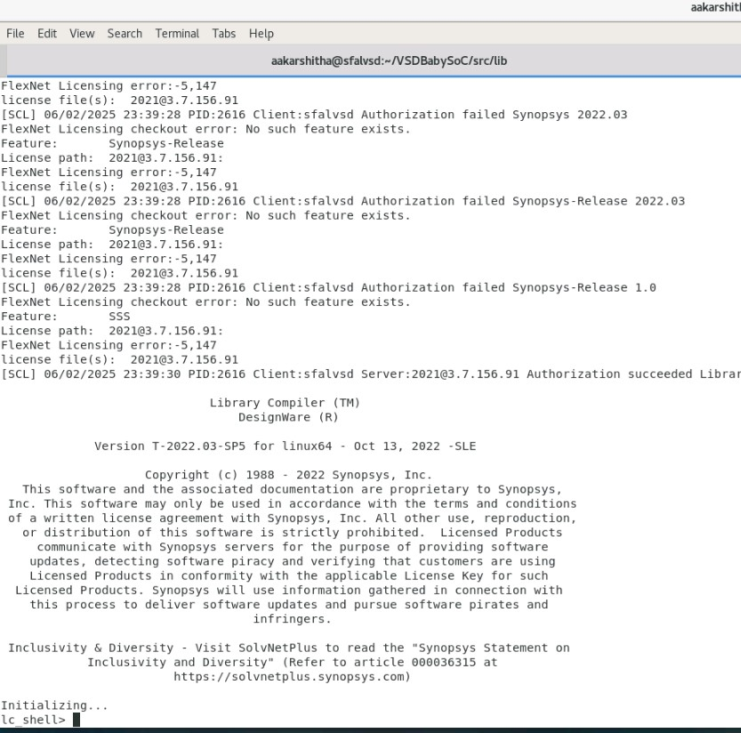
        - 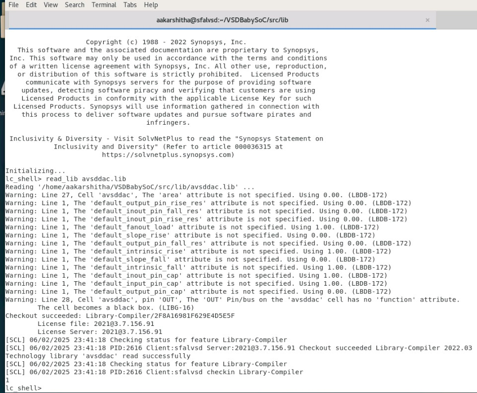
        - 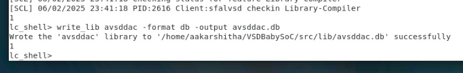
      - sky130 images
        - 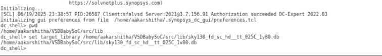
        - 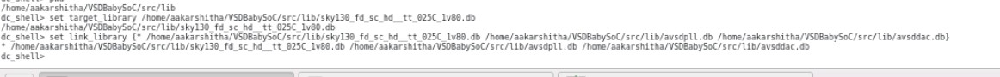
        - 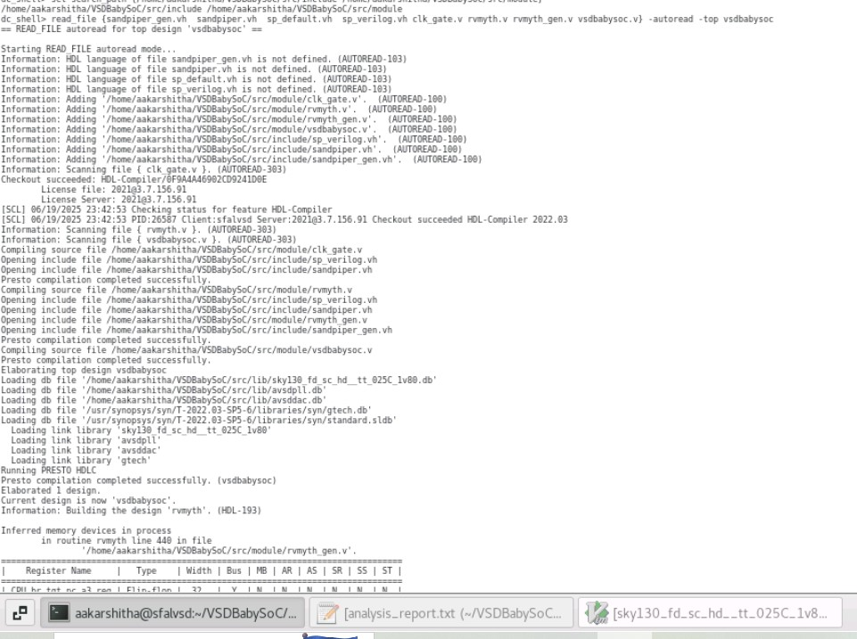
        - 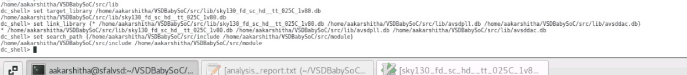
        - 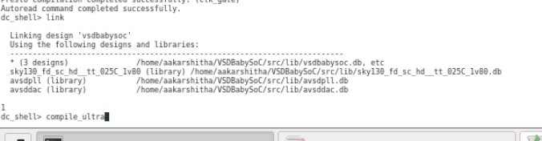
        - 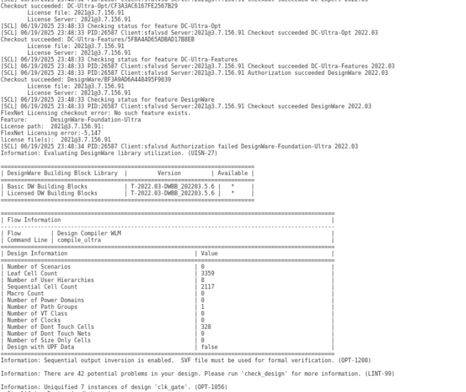
        - 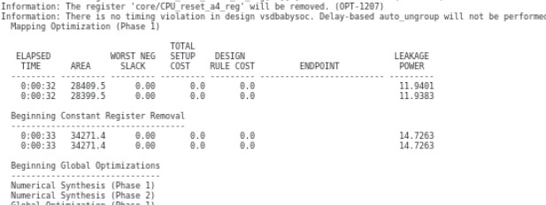
        - 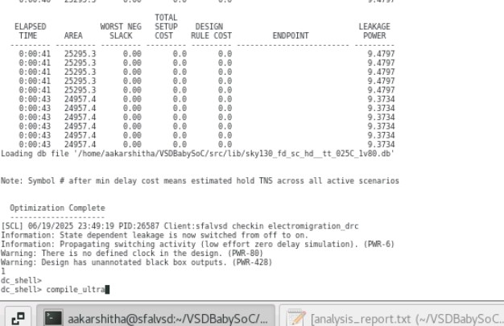
        - 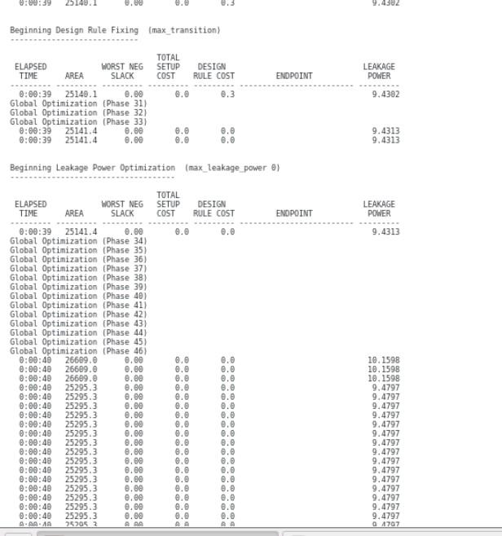
        - 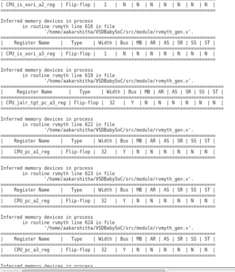
        - 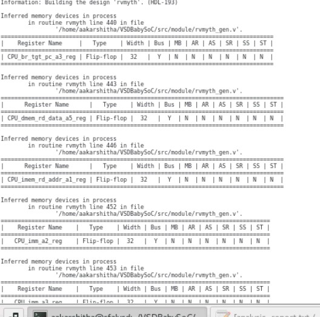
        - 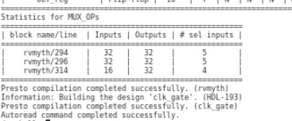
        - 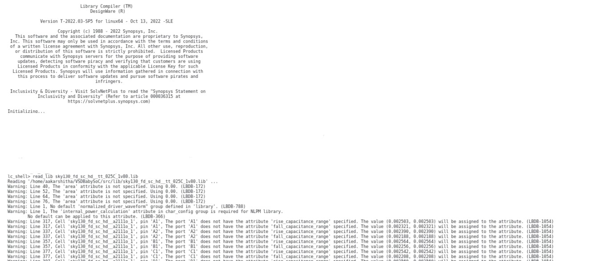
        - 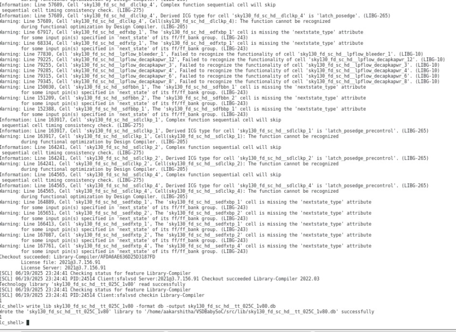
        - 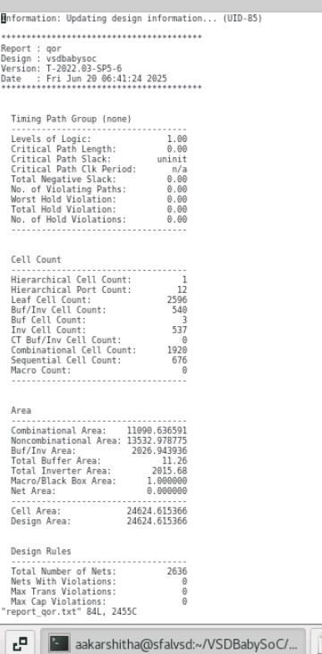
          
  - **Post Synthesis GLS Simulation**
    - Use these commands below:
      - cd Desktop/aakarshitha/VSDBabySoC/
      - iverilog -DFUNCTIONAL -DUNIT_DELAY=#1 -o ./output/post_synth_sim.out ./src/gls_model/primitives.v ./src/gls_model/sky130_fd_sc_hd.v ./output/vsdbabysoc_net.v ./src/module/avsdpll.v ./src/module/avsddac.v ./src/module/testbench.v
      - cd Desktop/aakarshitha/VSDBabySoC/output/
      - ./post_synth_sim.out
      - gtkwave dump.vcd
    - Images for this step:
      - 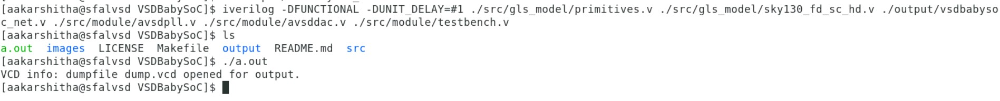
      - 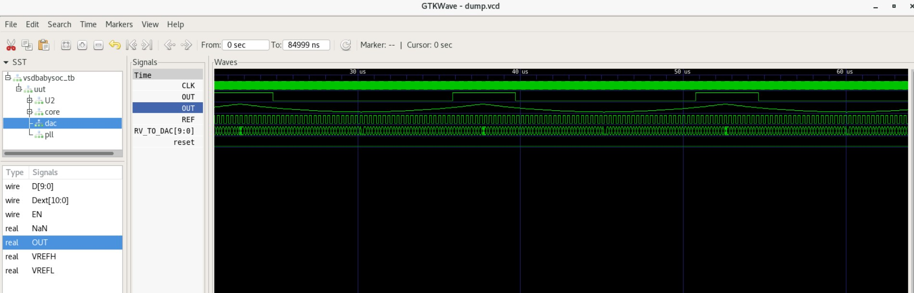
        
  - **Bugs faced during the process and their fixes**
    - Errors during .lib to .db conversion for avsdpll.lib
      - 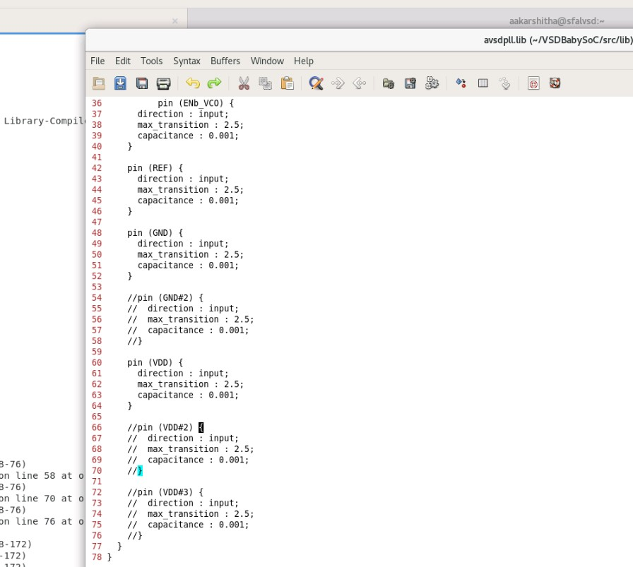
      - 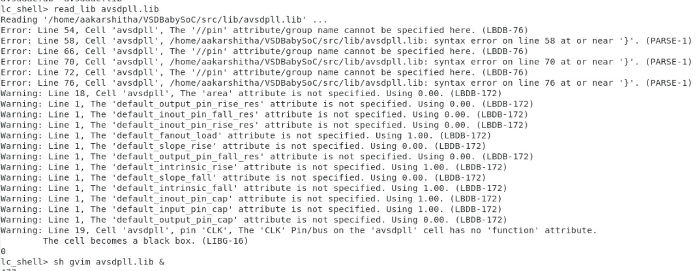
      - 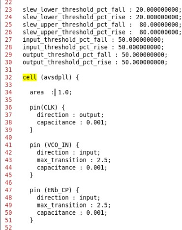
      - 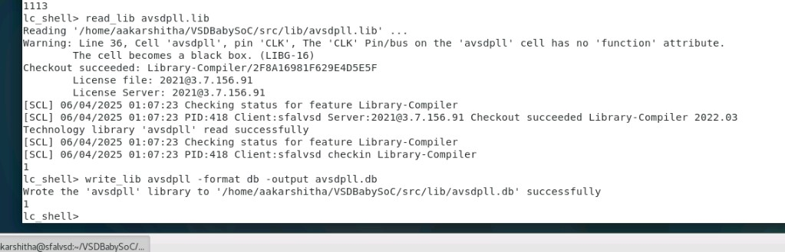
    - Errors during .lib conversion of sky130 lib file
      - images/Week5-6_BabySOC_PostSynthesis_Simulation/
      - 
    - Errors during GLS simulation
      - 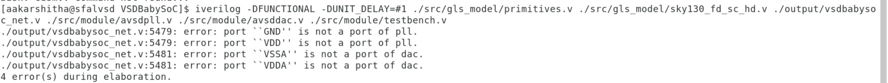
      

  
  
  
  

