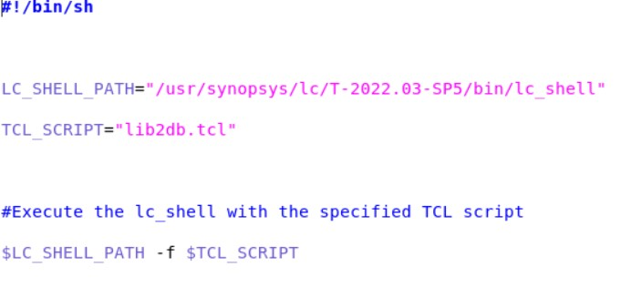
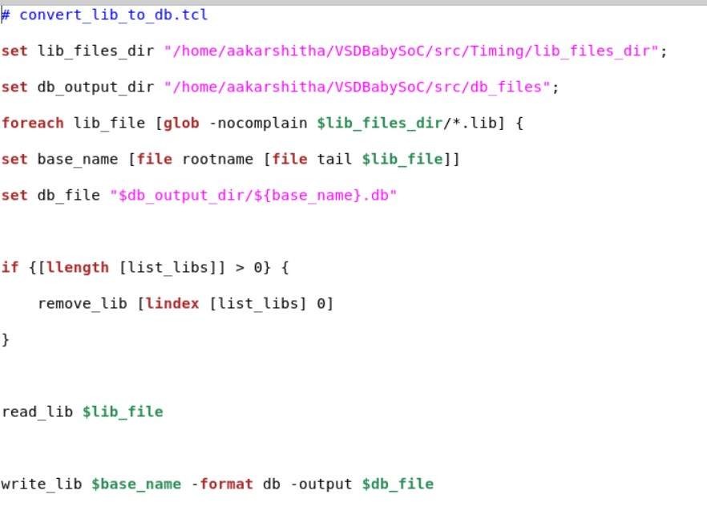
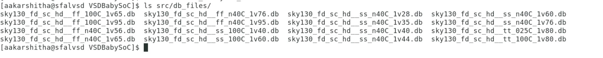
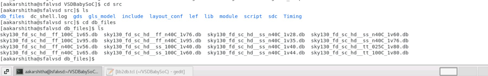
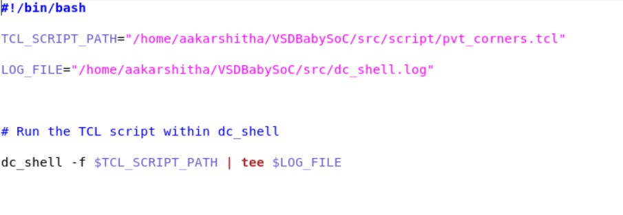
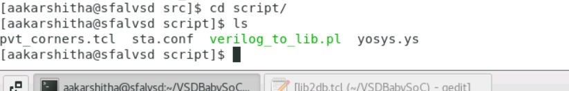
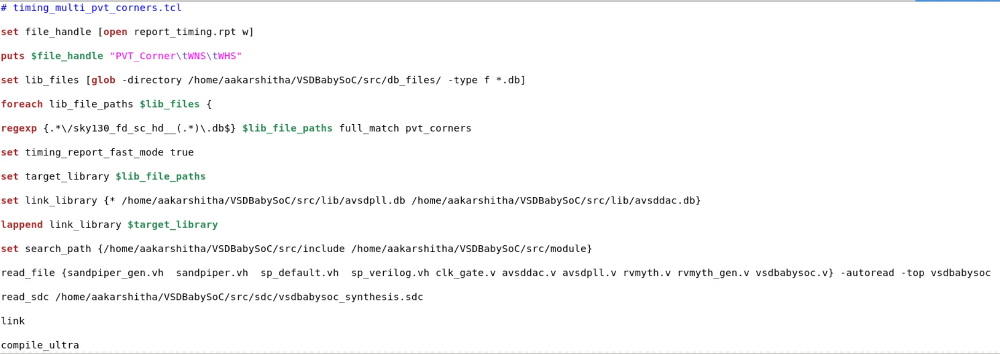
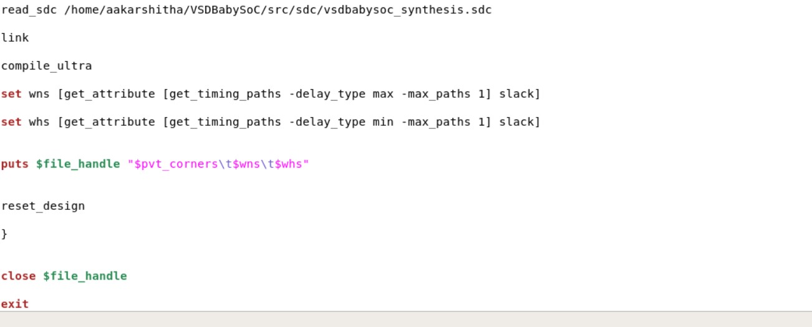
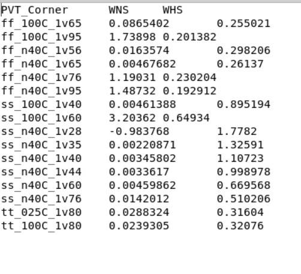

Week 7 - Process, Voltage and Temperature Corners with Timing Analysis and Impact on BabySOC

This task involved synthesis, timing analysis and reporting of post synthesis simulations for the multiple corners of Process, Voltage and Temperatures, on VSD BabySOC, using SDC(Synopsys Design Constraints) file, and other stimulus. This is usually done in industry with various PVT corners to ensure best operation for the required PPA specifications. 

  
 Post Synthesis and Multi PVT Corner Analysis in BabySOC Modelling

  
  - **What is PVT, SDC and Timing Analysis?**
    - 
  - **Reading SDC constraints and synthesizing the design**
    - Commands used are:
      - dc_shell
      - set target_library /home/aakarshitha/VSDBabySoC/src/lib/sky130_fd_sc_hd__tt_025C_1v80.db
      - set link_library {* /home/aakarshitha/VSDBabySoC/src/lib/sky130_fd_sc_hd__tt_025C_1v80.db /home/aakarshitha/VSDBabySoC/src/lib/avsdpll.db /home/aakarshitha/VSDBabySoC/src/lib/avsddac.db}
      - set search_path {/home/aakarshitha/VSDBabySoC/src/include /home/aakarshitha/VSDBabySoC/src/module}
      - read_file {sandpiper_gen.vh sandpiper.vh sp_default.vh sp_verilog.vh clk_gate.v avsddac.v avsdpll.v rvmyth.v rvmyth_gen.v vsdbabysoc.v} -autoread -top vsdbabysoc
      - link
      - read_sdc /home/aakarshitha/VSDBabySoC/src/sdc/vsdbabysoc_synthesis.sdc
      - compile_ultra
      - write_file -format verilog -hierarchy -output /output/vsdbabysoc_net_sdc_new.v
      - report_qor > /VSDBabySoC/output/report_qor_sdc_new.txt
      
  - **Post Synthesis Simulation**
    - Steps to be done post synthesis, follow same as the post synthesis GLS simulation we have done in previous weeks.
    - Commands used:
      - cd Desktop/aakarshitha/VSDBabySoC/
      - iverilog -DFUNCTIONAL -DUNIT_DELAY=#1 -o ./output/post_synth_sim.out ./src/gls_model/primitives.v ./src/gls_model/sky130_fd_sc_hd.v ./output/vsdbabysoc_net.v ./src/module/avsdpll.v ./src/module/avsddac.v ./src/module/testbench.v
      - cd Desktop/aakarshitha/VSDBabySoC/output/
      - ./post_synth_sim.out
      - gtkwave dump.vcd
          
  - **Multi-Corner Synthesis for all the PVT**
    - Steps below must be followed to make this analysis
    - Conversion of all the .lib files to .db format:
      - Use a script for this process. Steps are as follows:
      - Download Libraries: Obtain .lib files for different corners from [This](https://github.com/efabless/skywater-pdk-libs-sky130_fd_sc_hd/tree/master/timing).
      - Convert .lib to .db: Using Synopsys LC Shell, convert the .lib files to .db format for use in synthesis.
      - Script named conversion.sh contains the commands as in the image below. Use this to set the path for the tcl script that will do the conversion.
      - 
      - Make a directory using "mkdir db_files". Create TCL file nano lib2db.tcl.
      - 
      - 
      - Run conversion.sh using the command "./conversion.sh"
      - Then you get all the .db files inside the src/db_files directory.
      - 
    - Synthesis Script for multi-PVT Corners and result analysis
      - Follow the following steps to run a script that can use Design Compiler and run multiple PVT corners syntheses for the VSDBabySoC.
      - Create a pvt_corners.sh script wiht following content. It is used to set and run the tcl file and log path for the DC run.
      - 
      - Create under src/script directory your tcl script named pvt_corners.tcl
      - 
      - 
      - 
      - Go to VSDBabySoC and run the pvt corners shell script as "./pvt_corners.sh"
      - This will give your report_timing.rpt result in the same directory, open it to see all the Worst Negative Slack and Worst Hold Slack for each corner to get a comparison between different PVT.
    - Resulting analysis for multiple PVTs by synthesis using Design Compiler, performed using a shell script:
      - | PVT Corner       | WNS        | WHS       |
|------------------|------------|-----------|
| ff_100C_1v65     | 0.0865402  | 0.255021  |
| ff_100C_1v95     | 1.73898    | 0.201382  |
| ff_n40C_1v56     | 0.0163574  | 0.298206  |
| ff_n40C_1v65     | 0.00467682 | 0.26137   |
| ff_n40C_1v76     | 1.19031    | 0.230204  |
| ff_n40C_1v95     | 1.48732    | 0.192912  |
| ss_100C_1v40     | 0.00461388 | 0.895194  |
| ss_100C_1v60     | 3.20362    | 0.64934   |
| ss_n40C_1v28     | -0.983768  | 1.7782    |
| ss_n40C_1v35     | 0.00220871 | 1.32591   |
| ss_n40C_1v40     | 0.00345802 | 1.10723   |
| ss_n40C_1v44     | 0.0033617  | 0.998978  |
| ss_n40C_1v60     | 0.00459862 | 0.669568  |
| ss_n40C_1v76     | 0.0142012  | 0.510206  |
| tt_025C_1v80     | 0.0288324  | 0.31604   |
| tt_100C_1v80     | 0.0239305  | 0.32076   |
     - 
     - 
     - 
       
  - **Important Notable things during each step**
    - Errors and Precautions
      - Do not use real data type, itor, or delays in your design code.
      - Make sure any changes in your design .v files also get reflected in your .lib file so that the pins, etc match and not give any errors in DC during synthesis
      - Mkae sure all steps are correct, have correct search paths and file paths in your run scripts for PVT corners.
    - Result Anlysis
      - Only for ss_n40C_1v28 PVT corner, the Worst Negative Slack is seen as negative, rest all are positive, even if close to 0. Mainly the slack needs to be postive.
      

  
  
  
  

