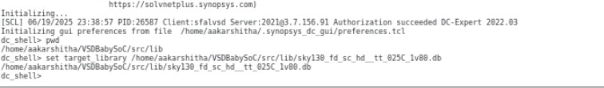

Week 7 - Process, Voltage and Temperature Corners with Timing Analysis and Impact on BabySOC

This task involved synthesis, timing analysis and reporting of post synthesis simulations for the multiple corners of Process, Voltage and Temperatures, on VSD BabySOC, using SDC(Synopsys Design Constraints) file, and other stimulus. This is usually done in industry with various PVT corners to ensure best operation for the required PPA specifications. 

  
 Post Synthesis and Simulation in BabySOC Modelling

  
  - **What is PVT, SDC and Timing Analysis?**
    - 
  - **Reading SDC constraints and synthesizing the design**
    - Commands used are:
      - dc_shell
      - set target_library /home/aakarshitha/VSDBabySoC/src/lib/sky130_fd_sc_hd__tt_025C_1v80.db
      - set link_library {* /home/aakarshitha/VSDBabySoC/src/lib/sky130_fd_sc_hd__tt_025C_1v80.db /home/aakarshitha/VSDBabySoC/src/lib/avsdpll.db /home/aakarshitha/VSDBabySoC/src/lib/avsddac.db}
      - set search_path {/home/aakarshitha/VSDBabySoC/src/include /home/aakarshitha/VSDBabySoC/src/module}
      - read_file {sandpiper_gen.vh sandpiper.vh sp_default.vh sp_verilog.vh clk_gate.v avsddac.v avsdpll.v rvmyth.v rvmyth_gen.v vsdbabysoc.v} -autoread -top vsdbabysoc
      - link
      - read_sdc /home/aakarshitha/VSDBabySoC/src/sdc/vsdbabysoc_synthesis.sdc
      - compile_ultra
      - write_file -format verilog -hierarchy -output /output/vsdbabysoc_net_sdc_new.v
      - report_qor > /VSDBabySoC/output/report_qor_sdc_new.txt
      
  - **Post Synthesis Simulation**
    - Steps to be done post synthesis
    - Commands used:
      - iverilog -DFUNCTIONAL -DUNIT_DELAY=#1 -o ./output/post_synth_sim_new.out ./src/gls_model/primitives.v ./src/gls_model/sky130_fd_sc_hd.v ./output/vsdbabysoc_net_sdc_new.v ./src/module/testbench.v

      - sky130 images
        - 

          
  - **Post Synthesis GLS Simulation**
    - Use these commands below:
      - cd 
    - Images for this step:
      - 

        
  - **Bugs faced during the process and their fixes**
    - Errors during 
    - Errors during 
      - 
      

  
  
  
  

